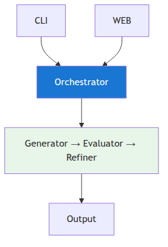
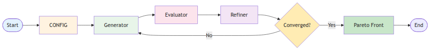
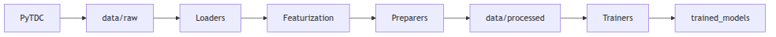

# Architecture

System design and component overview for BioQuest.

---

## Overview

BioQuest combines:
- **Multi-agent orchestration** for drug discovery workflow
- **Neural networks** for property prediction (GNN-DTI, Toxicity, Property)
- **Hybrid generation** (evolutionary + VAE) for novel molecules
- **Pareto optimization** for multi-objective selection

---

## System Architecture



---

## Agent Loop

The orchestrator runs an iterative loop:

1. **Generator** creates new molecules
2. **Evaluator** scores molecules on properties
3. **Refiner** optimizes and ranks candidates
4. Repeat until convergence



---

## Data Flow

```
PyTDC → loaders → featurization → preparers → training → trained_models/
```



---

## Key Components

### src/app/core.py
- **AgentOrchestrator**: Main workflow coordinator
- **GeneratorAgent**: Creates molecules (evolutionary + VAE)
- **EvaluatorAgent**: Scores molecules on objectives
- **RefinerAgent**: Optimizes and ranks candidates

### src/pipelines/
- **generation.py**: HybridMoleculeGenerator, MoleculeVAE
- **prediction.py**: MoleculePredictor wraps all models
- **optimization.py**: Pareto front selection, weighted sum

### src/models/
- **gnn_dti.py**: GNNDTIPredictor (1.2M params)
- **toxicity.py**: ToxicityClassifier (540K params)
- **property.py**: PropertyPredictor (380K params)
- **featurization.py**: Morgan fingerprints, RDKit descriptors

### src/training/
- **base.py**: Base Trainer class
- **gnn_dti_trainer.py**: GNNDTITrainer
- **toxicity_classifier_trainer.py**: ToxicityClassifierTrainer
- **property_predictor_trainer.py**: PropertyPredictorTrainer
- **molecule_vae_trainer.py**: MoleculeVAETrainer

---

## Configuration Schema

```json
{
  "protein_sequence": "required - target protein amino acids",
  "seeds": ["required - starting SMILES"],
  "objectives": {
    "affinity": 0.0-1.0,
    "toxicity": 0.0-1.0,
    "qed": 0.0-1.0,
    "sa": 0.0-1.0,
    "diversity": 0.0-1.0
  },
  "optimization": {
    "max_iterations": 100,
    "batch_size": 50,
    "patience": 20
  },
  "generation": {
    "vae_enabled": true,
    "evolutionary_enabled": true,
    "strategy": "hybrid"
  }
}
```

Objectives weights must sum to 1.0.

---

## Performance

| Model | Parameters | Training (GPU) | Inference |
|-------|------------|----------------|-----------|
| GNN-DTI | 1.2M | 30-60 min | 100ms |
| Toxicity | 540K | 15-30 min | 50ms |
| Property | 380K | 20-40 min | 30ms |
| VAE | - | 30-60 min | - |
